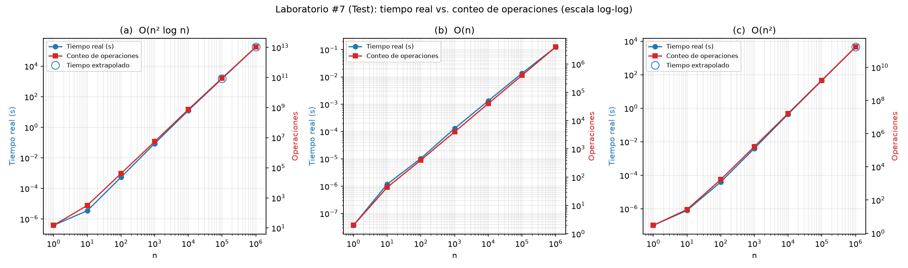

# Laboratorio #7: Análisis de Complejidad

Solucion del ejercicio 2 del laboratorio 7. Implementa un profiling y conteo  de operaciones sobre tres algoritmos con diferentes órdenes de complejidad:

1. **Algoritmo (a):** $\mathcal{O}(n^2 \log n)$
2. **Algoritmo (b):** $\mathcal{O}(n)$
3. **Algoritmo (c):** $\mathcal{O}(n^2)$

Las pruebas se ejecutan sobre los siguientes tamaños de entrada:

```python
[1,10,100,1000,10000,100000,1000000]
```

## Análisis 

### 1. Algoritmo (a) $\mathcal{O}(n^2 \log n)$

#### Código en C de referencia:
```c
void function(int n) {
    int i, j, k, counter = 0;
    for (i = n/2; i <= n; i++) {
        for (j = 1; j+n/2 <= n; j++) {
            for (k = 1; k <= n; k = k*2) {
                counter++;
            }
        }
    }
}
```

#### Conteo de operaciones:
* **Bucle exterior ($i$):** Comienza en $\lfloor n/2 \rfloor$ y finaliza en $n$.  
  Número de iteraciones: $n_i = n - \lfloor n/2 \rfloor + 1 \approx \frac{n}{2}$.  
  Verificaciones de condición ($i \le n$): $n_i + 1$.
* **Fórmula cerrada exacta:**
  $$T_a(n) = 2 + (n_i + 1) + n_i(n_j + 1) + n_i \cdot n_j (2n_k + 1)$$
* **Complejidad Asintótica:**
  $$T_a(n) \in \mathcal{O}\left(\frac{n}{2} \cdot \frac{n}{2} \cdot \log_2 n\right) = \mathcal{O}(n^2 \log n)$$

---

### 2. Algoritmo (b) $\mathcal{O}(n)$

#### Código en C de referencia:
```c
void function(int n) {
    if (n <= 1) return;
    int i, j;
    for (i = 1; i <= n; i++) {
        for (j = 1; j <= n; j++) {
            printf("Sequence\n");
            break;
        }
    }
}
```

#### Conteo de Operaciones:
* **Caso base ($n \le 1$):** Se evalúa la firma de la función (1) y la condición `if (n <= 1)` (1) $\implies 2$ operaciones.
* **Caso general ($n > 1$):**
  * Firma + verificación if falsa (2) + declaración `int i, j` (1) = 3 operaciones iniciales.
  * Bucle exterior ($i$): Se evalúa $i \le n$ un total de $n + 1$ veces.
  * Bucle interior ($j$): Debido a la instrucción `break;`, la condición $j \le n$ solo se evalúa **una única vez** ($j=1$), luego se ejecuta `printf` (1) y `break` (1). El bucle interno no itera más allá de $j=1$.
* **Fórmula cerrada exacta:**
  $$T_b(n) = \begin{cases} 2, & \text{si } n \le 1 \\ 3 + (n + 1) + 3n = 4n + 4, & \text{si } n > 1 \end{cases}$$
* **Complejidad Asintótica:**
  $$T_b(n) \in \mathcal{O}(n)$$

---

### 3. Algoritmo (c) — $\mathcal{O}(n^2)$

#### Código en C de referencia:
```c
void function(int n) {
    int i, j;
    for (i = 1; i <= n/3; i++) {
        for (j = 1; j <= n; j += 4) {
            printf("Sequence\n");
        }
    }
}
```

#### Conteo de Operaciones:
* **Firma y declaraciones:** 2 operaciones iniciales.
* **Bucle exterior ($i$):** Itera desde 1 hasta $\lfloor n/3 \rfloor$.  
  Número de iteraciones: $n_i = \lfloor n/3 \rfloor$.  
  Verificaciones de condición ($i \le n/3$): $n_i + 1$.
* **Bucle interior ($j$):** Itera desde 1 hasta $n$ con paso de 4 ($j = 1, 5, 9, 13, \dots$).  
  Número de iteraciones: $n_j = \lfloor \frac{n-1}{4} \rfloor + 1 = \lfloor \frac{n+3}{4} \rfloor$.  
  Verificaciones de condición ($j \le n$): $n_j + 1$.  
  Llamadas a `printf`: $n_j$.  
  Total de operaciones por iteración externa: $(n_j + 1) + n_j = 2n_j + 1$.
* **Fórmula cerrada exacta:**
  $$T_c(n) = 2 + (n_i + 1) + n_i(2n_j + 1) = 3 + n_i + n_i(2n_j + 1)$$
* **Complejidad Asintótica:**
  $$T_c(n) \in \mathcal{O}\left(\frac{n}{3} \cdot \frac{n}{4}\right) = \mathcal{O}\left(\frac{n^2}{12}\right) = \mathcal{O}(n^2)$$

---

## Metodología de profiling y medición

1. **Medición de Tiempo Real:**
   * Se utiliza el reloj monotónico de alta resolución `time.perf_counter_ns()`.
   * Para entradas pequeñas ($n \le 1\,000$), donde la resolución del sistema operativo introduce variabilidad, se promedian múltiples repeticiones adaptativas ($reps$) para obtener mediciones estables.
   * La salida de impresión de los algoritmos (b) y (c) se redirecciona a un descriptor `os.devnull` con buffer para evitar cuellos de botella generados por la consola.

2. **Doble Verificación de Conteo:**
   * Cada algoritmo incluye una versión instrumentada (`contar_operaciones_instrumentado`) que incrementa un contador por cada asignación, comparación y salto.
   * El orquestador ejecuta una aserción (`assert inst_ops == closed_ops`) verificando que el conteo empírico coincide exactamente con la fórmula matemática deducida.

3. **Extrapolación Justificada:**
   * Para el algoritmo (a) en $n = 10^6$, el número de operaciones supera $10^{13}$, lo que requeriría aproximadamente **48 horas** de ejecución continua en Python.
   * Para el algoritmo (c) en $n = 10^6$, requeriría más de **1.2 horas**.
   * En estos tamaños extremos, el tiempo se extrapola multiplicando el factor $\text{segundos}/\text{operación}$ medido empíricamente en el tamaño más alto ejecutable por el número exacto de operaciones teóricas. En las tablas y gráficas se identifican claramente como `(extrapolado)` y con marcadores circulares huecos.

---

## Resultados 

### Algoritmo (a) $\mathcal{O}(n^2 \log n)$
| $n$ | Conteo de Operaciones | Tiempo Real | Estado |
|:---:|:---:|:---:|:---:|
| $1$ | 15 | 386 ns | Medido |
| $10$ | 315 | 3.50 µs | Medido |
| $100$ | 40,905 | 538.39 µs | Medido |
| $1\,000$ | 5,512,005 | 86.48 ms | Medido |
| $10\,000$ | 750,160,005 | 12.56 s | Medido |
| $100\,000$ | 90,001,900,005 | 1506.64 s (~25.1 min) | Extrapolado |
| $1\,000\,000$ | 10,500,022,000,005 | 48.83 h | Extrapolado |

### Algoritmo (b) $\mathcal{O}(n)$
| $n$ | Conteo de Operaciones | Tiempo Real | Estado |
|:---:|:---:|:---:|:---:|
| $1$ | 2 | 37 ns | Medido |
| $10$ | 44 | 1.18 µs | Medido |
| $100$ | 404 | 10.43 µs | Medido |
| $1\,000$ | 4,004 | 129.43 µs | Medido |
| $10\,000$ | 40,004 | 1.33 ms | Medido |
| $100\,000$ | 400,004 | 13.58 ms | Medido |
| $1\,000\,000$ | 4,000,004 | 124.12 ms | Medido |

### Algoritmo (c) $\mathcal{O}(n^2)$
| $n$ | Conteo de Operaciones | Tiempo Real | Estado |
|:---:|:---:|:---:|:---:|
| $1$ | 3 | 103 ns | Medido |
| $10$ | 27 | 798 ns | Medido |
| $100$ | 1,719 | 39.64 µs | Medido |
| $1\,000$ | 167,169 | 4.02 ms | Medido |
| $10\,000$ | 16,671,669 | 445.70 ms | Medido |
| $100\,000$ | 1,666,716,669 | 44.66 s | Medido |
| $1\,000\,000$ | 166,667,166,669 | 1.24 h | Extrapolado |

---

## Gráfica



## Instrucciones 

### Prerrequisitos
- [uv](https://docs.astral.sh/uv/) 

### 1. Ejecucion

Para ejecutar el profiling de todos los algoritmos, regenerar el CSV y graficar:
```bash
uv run python main.py
```

### 2. Usar el graficador (`plot.py`)

  ```bash
  uv run python plot.py
  ```

### 3. Ejecución individual por algoritmo

```bash
uv run python src/algoritmo_a.py 1 10 100 1000
uv run python src/algoritmo_b.py 1 10 100 1000 10000 100000 1000000
uv run python src/algoritmo_c.py 1 10 100 1000 10000
```
